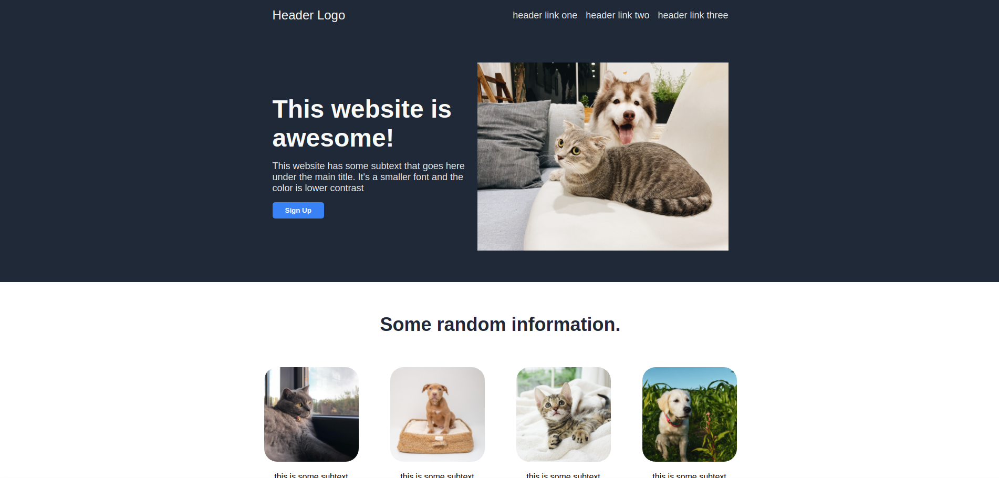

# The Odin Project

## Project: Landing page

This is a landing page built using HTML and CSS. Designed to exercise my Flexbox and CSS Grid skills.

🔗 **Live preview** of the page is [here](https://ajclay7.github.io/Landing-Page/).

### Outcome of this project:

- Deepened knowledge of **HTML** and **CSS**.
- Improved **CSS Grid** & **Flexbox** understanding and usage.
- Mobile friendly and responsive designs

### Preview of the web page:

📷 Photo Credits: 

- Photo by <a href="https://unsplash.com/@tranmautritam?utm_source=unsplash&utm_medium=referral&utm_content=creditCopyText">Tran Mau Tri Tam</a> on <a href="https://unsplash.com/s/photos/dog-and-cat?utm_source=unsplash&utm_medium=referral&utm_content=creditCopyText">Unsplash</a>

- Photo by <a href="https://unsplash.com/@lalieken_99?utm_source=unsplash&utm_medium=referral&utm_content=creditCopyText">larissa dupont</a> on <a href="https://unsplash.com/s/photos/cat?utm_source=unsplash&utm_medium=referral&utm_content=creditCopyText">Unsplash</a>

- Photo by <a href="https://unsplash.com/@theluckyneko?utm_source=unsplash&utm_medium=referral&utm_content=creditCopyText">The Lucky Neko</a> on <a href="https://unsplash.com/s/photos/cat?utm_source=unsplash&utm_medium=referral&utm_content=creditCopyText">Unsplash</a>

- Photo by <a href="https://unsplash.com/@goldengirl1990?utm_source=unsplash&utm_medium=referral&utm_content=creditCopyText">Alice Oneill</a> on <a href="https://unsplash.com/s/photos/dog?utm_source=unsplash&utm_medium=referral&utm_content=creditCopyText">Unsplash</a>

- Photo by <a href="https://unsplash.com/@jordanbigs?utm_source=unsplash&utm_medium=referral&utm_content=creditCopyText">Jordan Bigelow</a> on <a href="https://unsplash.com/s/photos/dog?utm_source=unsplash&utm_medium=referral&utm_content=creditCopyText">Unsplash</a>

